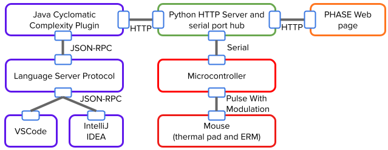

# MOUSE: Multimodal Output for Understanding Software Energy 

Creators : 
* Pierre-Antoine Cabaret - Rainbow Research Team, INSA Rennes, University of Rennes, IRISA
  * ATER at INSA Rennes, France (**looking for a permanent position in academic**)
  * personal website: https://pcabaret.github.io/
* Quentin Perez - DiverSE Research Team, INSA Rennes, University of Rennes, IRISA
  * Associate Professor at INSA Rennes, France
  * personal website: https://qperez.github.io/ 

## What is MOUSE?

MOUSE is a haptic and pseudo-haptic feedback system designed to provide a user experience related to software energy consumption.

MOUSE is both a physical and software-based device. The hardware component was built using off-the-shelf components.

It is based on an M5Stack Core microcontroller that uses PWM control to drive an ERM (Eccentric Rotating Mass) vibration motor and a thermal heating pad.

The software component consists of both a Python server and microcontroller firmware written in C and deployed on an M5Stack Core One.

More information can be found in the Software Arhitecture section.

## Bills Of Materials and 3D models

### BOM: 
* 1x, Wireless Mouse Components Kit, 13€, https://eu.store.bambulab.com/products/wireless-mouse-components-kit-002 
* 1x, M5Stack Core One, 43.13€, https://fr.rs-online.com/web/p/accessoires-pour-outils-de-developpement/0314175
* 1x Power MOSFET IRF540N (5 pieces), 1.70€, https://opencircuit.shop/product/irf540n-power-mosfet-5-pcs
* 1x 10k ohm Resistors (10 pieces), 1.65€ ,https://opencircuit.shop/product/10k%CF%89-metal-film-resitor-1-4w-10-pieces
* 2x Diode Rectifier 1N4001, 0.25€  https://opencircuit.shop/product/diode-rectifier-1a-50v-1n4001
* 1x Heating Pad, https://opencircuit.shop/product/heating-pad-5x10cm
* 1x M5 Proto Module, 4.76€ https://fr.rs-online.com/web/p/accessoires-pour-outils-de-developpement/2027602
* 1x Male Pins, 2.79€, https://www.conrad.fr/fr/p/barrette-male-standard-te-connectivity-ampmodu-mod-ii-826629-8-nbr-de-rangees-1-nombre-de-poles-par-rangee-8-1-pc-s-1094760.html
* 1x USB A power Cable, 2.49€ ,https://eu.store.bambulab.com/products/usb-a-power-cable-with-ph2-0-connector
* 1x 1kg PLA spool, 18.79€, Amazon
* 
### 3D Models

* Mouse shell: https://store.bblcdn.eu/s8/default/680ed2ecb3624801b80e00a56af25af7/3D_model_for_Wireless_Mouse_Kit-002.zip
* Mouse model (ergo mouse Snake model): https://makerworld.com/en/models/479899?from=search#profileId-391349

## Hardware Building

Section in progress...

## Software Architecture



## Project structure

The project is split into five components:

```
.
├── IDE_LSP_plugin/            # Java LSP plugin (Maven)
├── C_code_M5Stack_core_one/   # C firmware for the M5Stack (PlatformIO)
├── mouse_server_serial_hub/   # Python Flask server (central hub)
├── web_graphic_user_interface/
│   └── mouse_page.html        # Web control interface
├── http_api_documentation/
│   └── openapi.yaml           # REST API documentation (OpenAPI 3.0)
├── github_action_example      # GitHub action sample 
├── figures/                   # Visual assets
└── README.md
```

### IDE LSP Plugin (`IDE_LSP_plugin/`)

A Java LSP (Language Server Protocol) plugin built with Maven. It computes the cyclomatic complexity of each method in real time using `CyclomaticComplexityAnalyzer`, then forwards the metrics to the Flask server via `POST /metric/complexity`.

### M5Stack firmware (`C_code_M5Stack_core_one/`)

A C firmware project built with PlatformIO for the M5Stack Core One. It receives commands from the Flask server over serial and drives:
- the LVGL display (`chart.c`, `code_img.c`, `cpu_img.c`);
- the PWM haptic feedback, scaled to McCabe complexity thresholds.

### Flask server (`mouse_server_serial_hub/`)

The central piece. It exposes the REST API and coordinates the other components:

| Sub-folder | Role |
|---|---|
| `controllers/` | HTTP entry points (Flask Blueprints): X11 mouse, thermal modes, complexity |
| `services/` | Business logic: PWM computation, thermal state, xinput |
| `shared/` | State shared across requests: `SharedThermalState`, `SharedCyclomaticComplexityObject`, `SharedMouseState` |
| `serial_mouse/` | Singletons for the serial connection and the X11 mouse driver |

### Web interface (`web_graphic_user_interface/`)

A single HTML page (`mouse_page.html`) for controlling mouse speed, thermal modes, and monitoring system state from a browser.

### API documentation (`http_api_documentation/`)

An **OpenAPI 3.0** specification covering all REST endpoints: X11 mouse management, IDE/GUI thermal modes, and cyclomatic complexity metric ingestion.

### GitHub Action (`github_action_example/`)

Feedback can be activated remotely through HTTP requests or MQTT. We provide this example of an integration into a GitHub Actions workflow, with feedback being displayed depending on the CPU load of a workflow step.